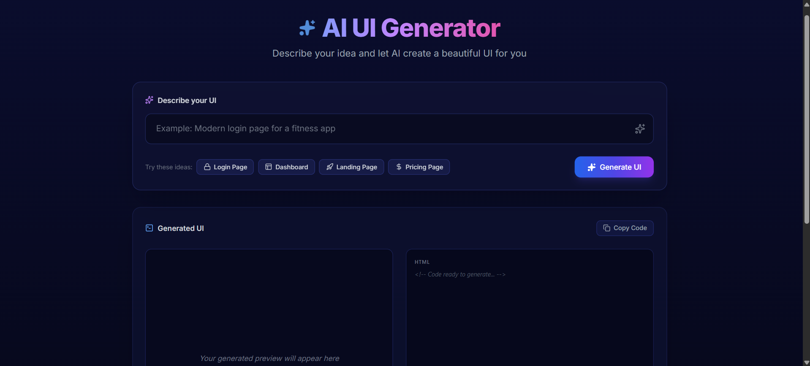
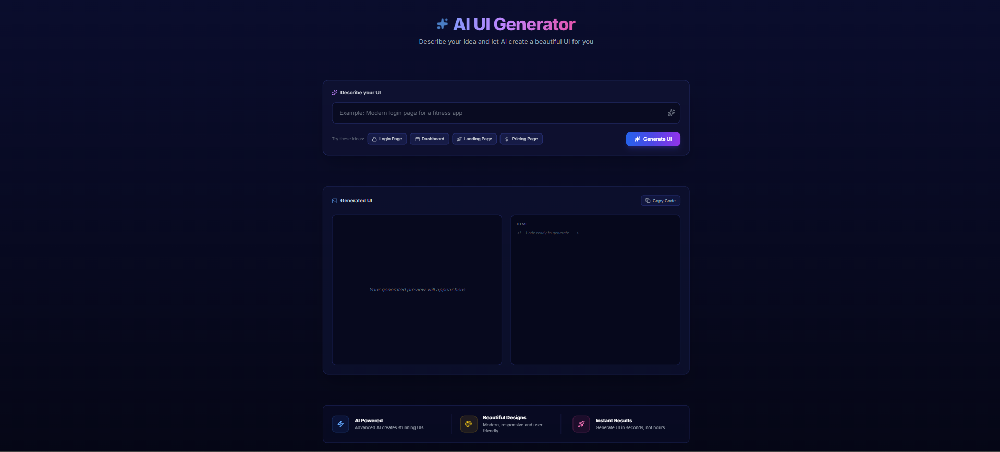
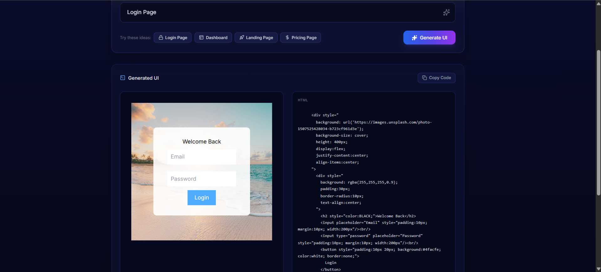
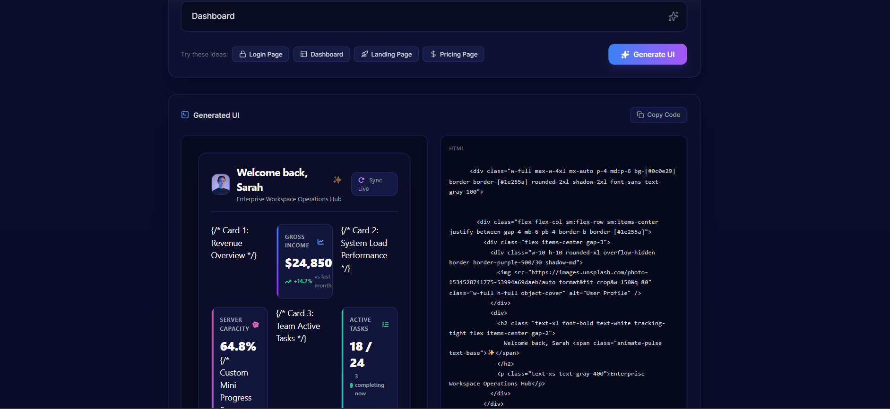
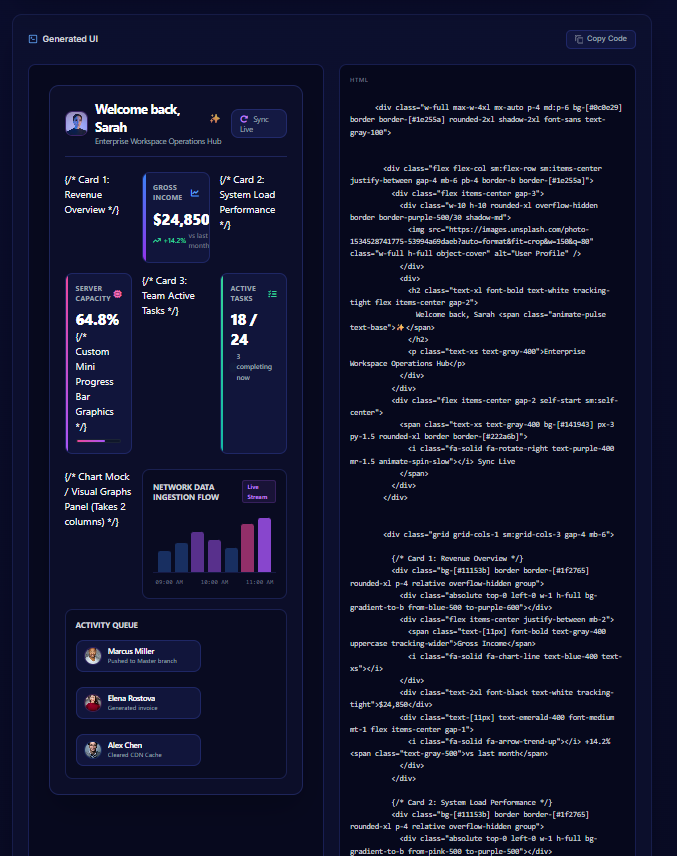
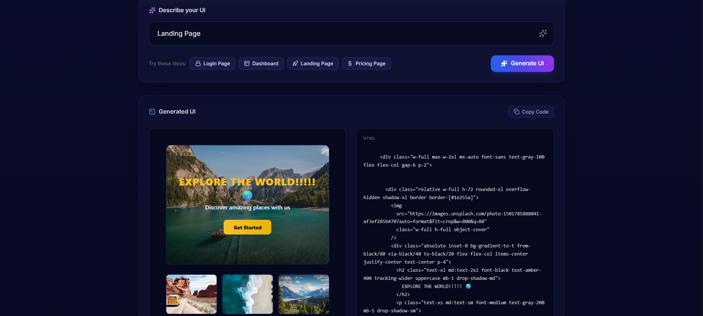
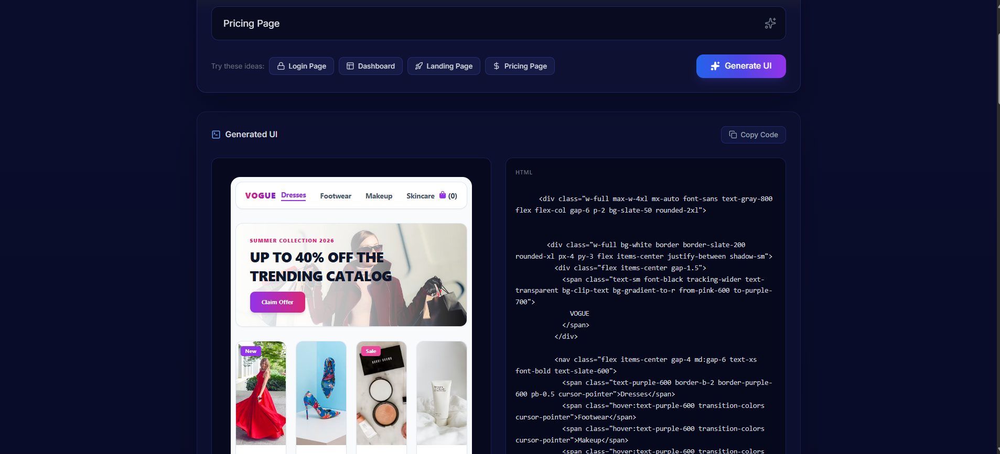
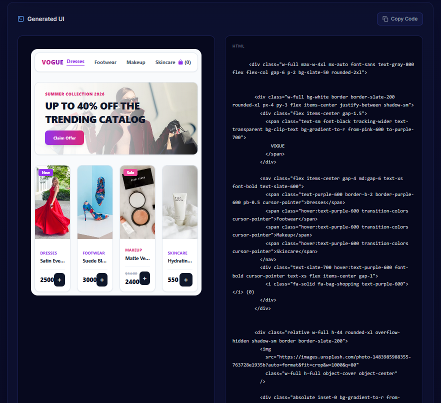
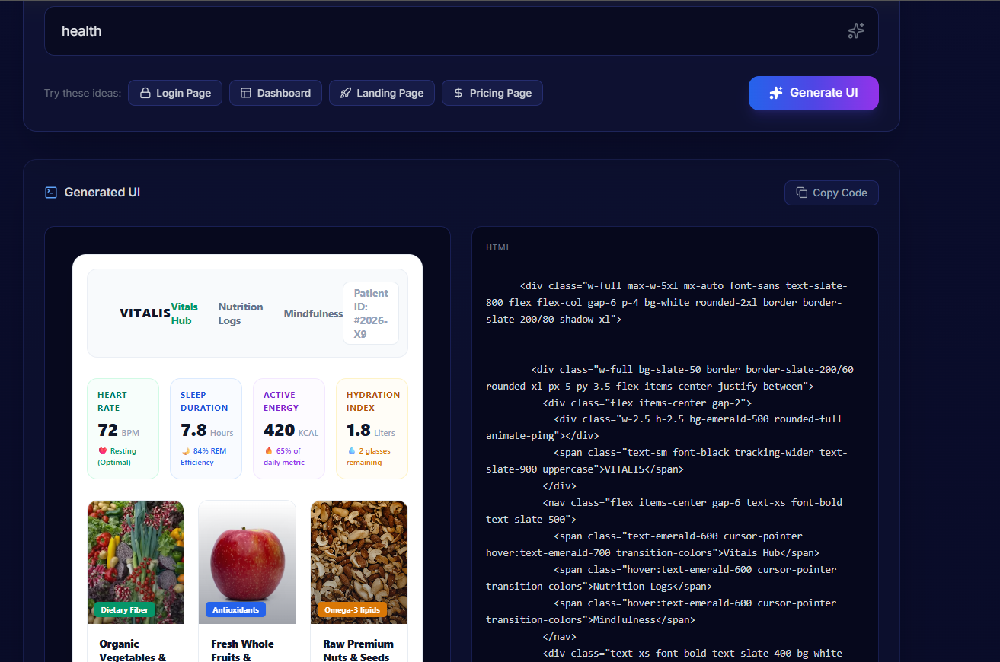
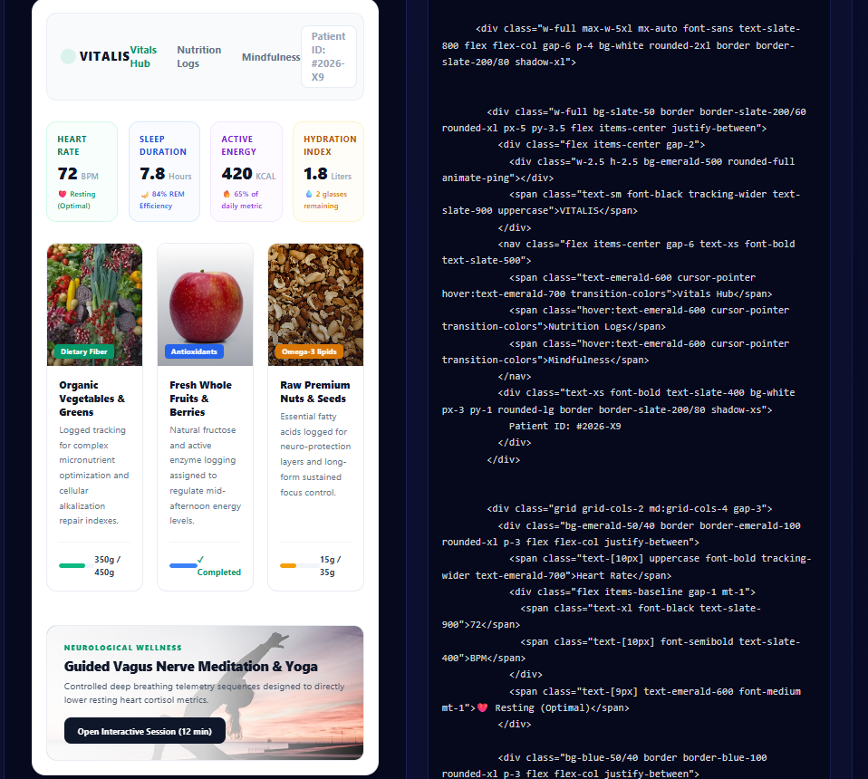

# ✨ AI UI Generator

An AI-inspired UI Generator built with React.js, Node.js, and Express.js that generates modern, responsive user interface layouts from text prompts.

## 🚀 Features

- Generate Login Page UI
- Generate Dashboard UI
- Generate Landing Page UI
- Generate Pricing Page UI
- Generate Healthcare UI
- Live UI Preview
- HTML Code Preview
- Responsive Design

## 🛠️ Tech Stack

- React.js
- Node.js
- Express.js
- HTML5
- CSS
- JavaScript


## 🤖 AI Tools Used

This project was developed with the assistance of the following AI tools:

### ChatGPT (OpenAI)
- Brainstormed the project idea.
- Helped implement the React.js and Node.js application.
- Assisted in debugging frontend and backend issues.
- Improved code structure and project documentation.

### Google Gemini
- Suggested modern UI/UX layouts and styling improvements.
- Helped enhance the visual design of the generated pages.
- Assisted with responsive design and UI customization.
- Provided code suggestions for refining the frontend interface.


## 📸 Project Screenshots

### 🏠 Home Page


### 🏡 Homepage UI


### 🔐 Login Page


### 📊 Dashboard


### 📈 Dashboard UI


### 🌍 Landing Page


### 💰 Pricing Page


### 💳 Pricing UI


### 🏥 Healthcare Page


### 🏥 Healthcare UI


## ▶️ How to Run

### Frontend

```bash
npm install
npm start
```

### Backend

```bash
node index.js
```
